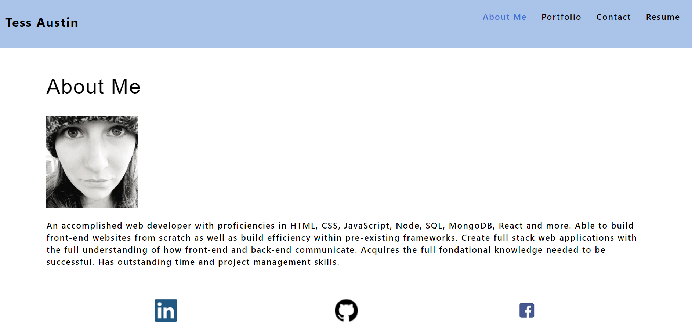

# Portfolio 2.0

## Description:
This is my portfolio. I created it with React.js. Through this you can view info about me, see my top 6 projects, contact me, and view my resume. Any employer can view and see if i am a good candidate for their open position. 

## Licensing:

## Table of Contents 
* [Description](#description)
* [Installation](#installation)
* [Usage](#usage)
* [Technology](#technology)
* [Questions](#questions)
* [Screenshot](#Screenshot)

## Installation:
- npm install
- npx create-react-app (app-name)

## Usage:
https://tessaustin.github.io/portfolio2.0/

## Technology:
- React
- Heroku

## Questions:
Please reach me through my Github account or my email with any additional questions.
- Github: [tessaustin](https://github.com/tessaustin)
- Email: tessaustin92@gmail.com 

## Screenshot:

